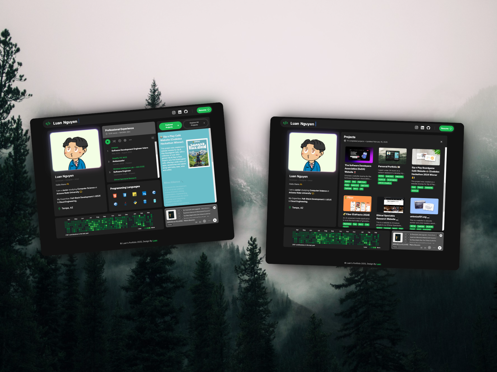

# Personal Portfolio 🪴

> Demo: [luannguyen.net](https://www.luannguyen.net)

If you want the reusable starter version without my personal content, use the
[spotify-portfolio](https://github.com/LuaanNguyen/spotify-portfolio) template.



A modern, responsive portfolio website featuring a design, inspired by Spotify.

To develop, run:

```bash
$ git clone https://github.com/LuaanNguyen/portfolio.git
$ npm install
$ npm run dev
```

To run with Docker:

```bash
$ docker build -t luan/portfolio .
$ docker run --rm -p 3000:3000 luan/portfolio
```

With hot reload:

```bash
$ docker compose -f docker-compose.dev.yml up
```

---

Made with ❤️ by [Luan Nguyen](https://www.linkedin.com/in/luaanng/)
